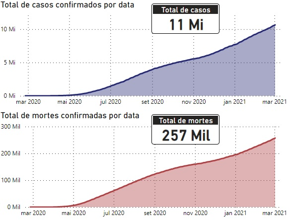

# 🦠 Atuação da COVID19 no Brasil - Análise de Dados 
## 📝 Sobre o projeto
Análise de dados em um conjunto de dados sobre o avanço do coronavírus no Brasil nos anos de 2020 e 2021, conjunto de dados disponível [aqui](https://www.kaggle.com/datasets/unanimad/corona-virus-brazil).

<<<<<<< HEAD
#### 👨🏼‍💻 Tecnologias utilizadas:
=======
👨🏼‍💻 Tecnologias utilizadas:
>>>>>>> d1ff893e8997eda169cefe69094d62d8d750f1c6
- Python
- Jupyter Notebook
- Power BI

## 📊 Dashboard

Dashboard principal informando casos e mortes:
- Por região
- Totais
- Novos
- Por data

<<<<<<< HEAD
## Storytelling
Até o dia 23 de maio de 2021 temos no total 16 milhões de casos confirmados de pessoas infectadas pelo coronavírus e 449 mil mortes decorrentes dessa doença. 
Observando o gráfico notamos que o número de casos e mortes so aumentam, atingimos os 5 milhões de infectados por volta de outubro de 2020 e nesse mesmo período cerca de 180 mil mortes, isso é 6 meses após o primeiro caso confirmado, e em fevereiro de 2021 dobramos o número de infectados (5 meses após atingir 5 milhões) com aproximadamente 250 mil mortes.

Nas regiões podemos observar que a região Sudeste e Nordeste estão disparadas a frente em número de casos e mortes em relação as outros demais regiões, parte disso se deve por causa de suas respectivas populações, a região Sudeste possui aproximadamente 81 milhões de habitantes, cerca de 42% da população brasileira enquanto a região Nordeste possui 53 milhões de habitantes, cerca de 28% da população, então é esperado que os números de casos e mortes sejam maiores para essas regiões.

Observando a relação de casos e mortes com os estados notamos que na maioria dos estados a proporção de casos e mortes segue semelhante, com exceção do RJ onde a proporção de mortos por caso é maior que nos restante dos estados, cerca de 5,9% dos infectados vieram a óbito no Rio de Janeiro, em contrapartida a média dos infectados que vieram a óbito dos outros estados é de 2,8%.

### Dashboard principal com a utilização de filtros, o filtro selecionado mostra apenas os resultados na data 02/06/2020 até a data 16/12/2020.

### Dashboard secundário informando casos e mortes por estado e o percentual de cada estado.

### Dashboard secundário com a utilização de filtros por estado, na imagem estão selecionado os estados: SP, PR, SC, RJ e DF.
=======
Dashboard principal com a utilização de filtros, o filtro selecionado mostra apenas os resultados na data 02/06/2020 até a data 16/12/2020.

Dashboard secundário informando casos e mortes por estado e o percentual de cada estado.

Dashboard secundário com a utilização de filtros por estado, na imagem estão selecionado os estados: SP, PR, SC, RJ e DF.
>>>>>>> d1ff893e8997eda169cefe69094d62d8d750f1c6

