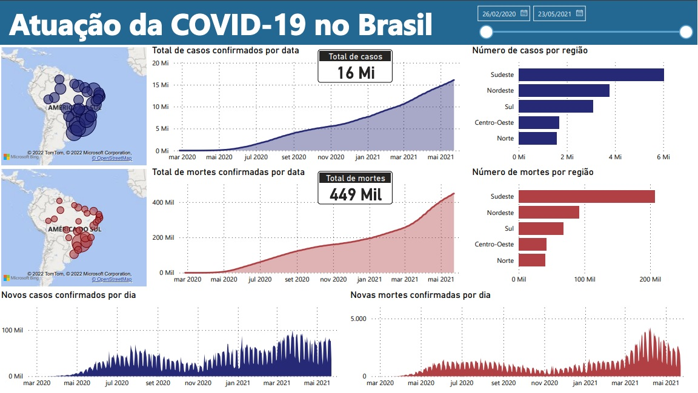
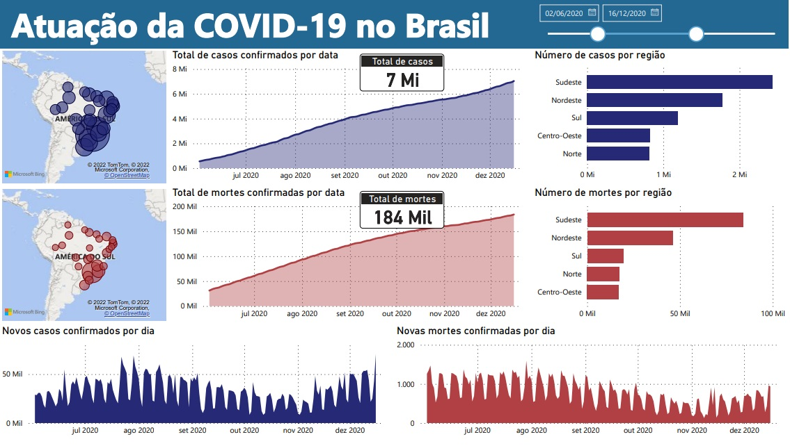
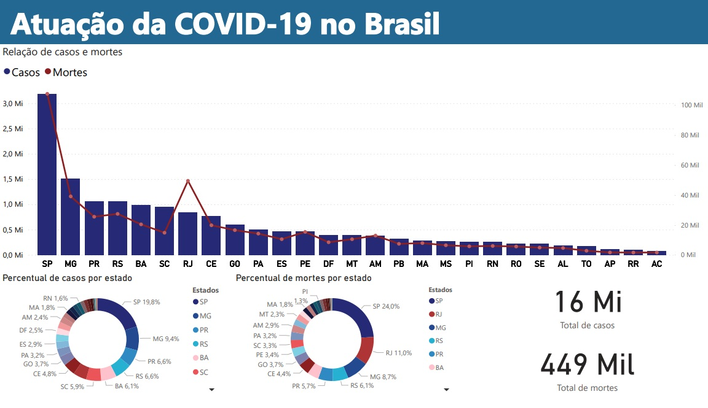
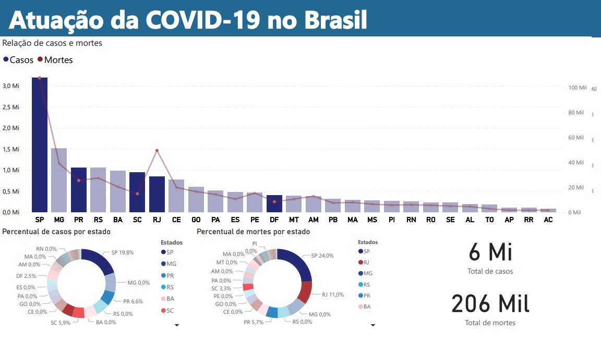

# 🦠 Atuação da COVID19 no Brasil - Análise de Dados 
## 📝 Sobre o projeto
Análise de dados em um conjunto de dados sobre o avanço do coronavírus no Brasil nos anos de 2020 e 2021, conjunto de dados disponível [aqui](https://www.kaggle.com/datasets/unanimad/corona-virus-brazil).

👨🏼‍💻 Tecnologias utilizadas:
- Python
- Jupyter Notebook
- Power BI

## 📊 Dashboard

Dashboard principal informando casos e mortes:
- Por região
- Totais
- Novos
- Por data

Dashboard principal com a utilização de filtros, o filtro selecionado mostra apenas os resultados na data 02/06/2020 até a data 16/12/2020.

Dashboard secundário informando casos e mortes por estado e o percentual de cada estado.

Dashboard secundário com a utilização de filtros por estado, na imagem estão selecionado os estados: SP, PR, SC, RJ e DF.

